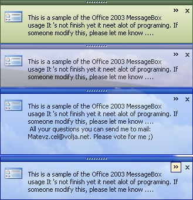



## Office 2003 Popup Message Box \*Updated\*

### Description

Popup Message box style like Office 2003 now in al XP themes (Blue, Silver, Olive. Look at screen shoot. Please vote for Code.
 
### More Info
 

             |
---                |---
**Submitted On**   |2004-06-01 21:43:46
**By**             |[Matevz](https://github.com/Planet-Source-Code/PSCIndex/blob/master/ByAuthor/matevz.md)
**Level**          |Intermediate
**User Rating**    |5.0 (90 globes from 18 users)
**Compatibility**  |VB 5\.0, VB 6\.0
**Category**       |[Custom Controls/ Forms/  Menus](https://github.com/Planet-Source-Code/PSCIndex/blob/master/ByCategory/custom-controls-forms-menus__1-4.md)
**World**          |[Visual Basic](https://github.com/Planet-Source-Code/PSCIndex/blob/master/ByWorld/visual-basic.md)
**Archive File**   |[Office\_200175336632004\.zip](https://github.com/Planet-Source-Code/matevz-office-2003-popup-message-box-updated__1-54133/archive/master.zip)

